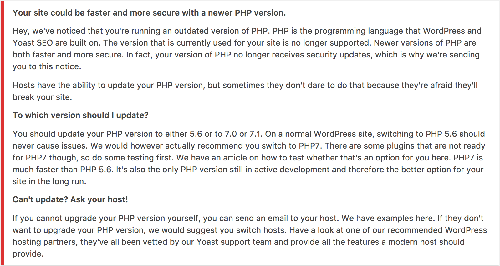

# whip
A WordPress package to nudge users to upgrade their software versions (starting with PHP)



## Requirements

The following versions of PHP are supported:

* PHP 5.2
* PHP 5.3
* PHP 5.4
* PHP 5.5
* PHP 5.6
* PHP 7.0
* PHP 7.1

WordPress is also required for certain functionality:

* The `WPMessagePresenter` requires WordPress or a function called `add_action`, to hook into WordPress.
* The `PHPVersionDetector` requires WordPress or a function called `__`, to translate strings.

## Installation

```bash
$ composer require yoast/whip 
```

## Usage

To require users to have PHP 5.6 or higher and show them a message if this is not the case you can use the following code:

```php
$wpMessagePresenter = new WPMessagePresenter();
$wpMessagePresenter->register_hooks();

$versionMessageControl = new VersionMessageControl(
	new PHPVersionDetector(),
	array( $wpMessagePresenter )
);
$versionMessageControl->requireVersion( '5.6' );
```

There is also a convenient helper method that you can use:

```php
Whip_VersionMessage::require_versions( array(
	'php' => '5.6',
) );
```

### Adding a message as a host

It is possible to add a custom message to the PHP version message by setting specific environment variables:

```php
putenv( "WHIP_NAME_OF_HOST=Name of the host" );
putenv( "WHIP_MESSAGE_FROM_HOST_ABOUT_PHP=A message from the host" );
```

The `WHIP_NAME_OF_HOST` environment variable could be reused in the future for showing messages about different software packages.

## Backwards compatibility policy

We follow [semantic versioning][semver] with an extra strict rule for MAJOR versions. We will do a major version bump whenever we add new methods. We have to do this because of the shared namespace in PHP. When this package will be used in multiple plugins we cannot safely add and use a method without bumping a major version. This is because the version without the new method may be autoloaded and then a fatal error occurs.

This also means that any major version bump is accompanied by a change of all class names in the package. So for version 2 of this package all classes will be postfixed with `_v2`. This prevents fatal errors when two plugins include different versions of this package.

## Changelog


## Security

If you discover any security related issues, please email security@yoast.com instead of using the issue tracker.

## Credits

* [Team Yoast](https://github.com/yoast)


[semver]: http://semver.org/
